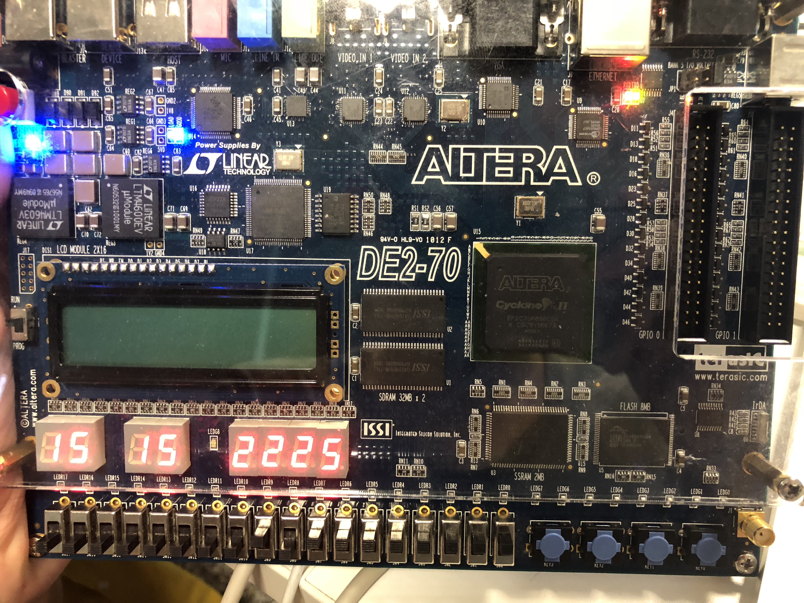

## Dead simple calculator hardware design using VHDL


Specs
```
The AriLogCal module can perform correctly arithmetic and logical operations between two operands OpA and OpB. Each operand is a positive integer ranging from 0 to 15.
The AriLogCal module supports below arithmetic operations:
• Addition: OpA + OpB
• Multiplication: OpA x OpB
• Division: OpA / OpB
o The result will be an integer. For example, if: OpA = 3 and OpB = 2, then: OpA / OpB = 1. o Division by 0 will result in an error message “Err”
The AriLogController supports below logical operations:
• Logical AND
• Logical OR
The operation is select based on the value of the input DoOpt (from 1 to 5).
For each computation, the two operands, the selected arithmetic/logical operator, and the arithmetic/logical operation result are displayed on eight 7-segment LEDs. The outputs Segi (i=0..7) are used to control the display of the eight 7-segment LEDs HEXi (i=0..7), respectively.
• {Seg7, Seg6} are used to display the operand OpA. For example: o If OpA=7 then Seg7 displays 0 and Seg6 displays 7.
• {Seg5, Seg4} are used to display the operand OpB.
• Seg3 is used to display the selected arithmetic/logical operator. Seg3 displays:
o 1 for addition
o 2 for multiplication
o 3 for division
o 4 for logical AND operation o 5 for logical OR operation
• {Seg2, Seg1, Seg0} are used to display the operation result. For example:
o If the result is 143, then Seg2 displays 1, Seg1 displays 4, and Seg0 displays 3.
```